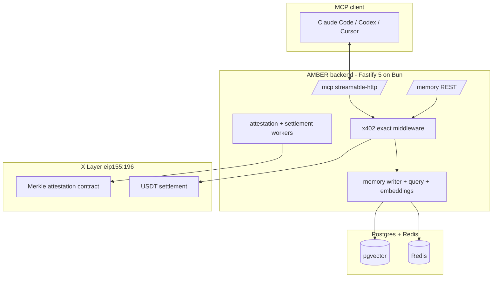

**Persistent, portable memory-as-a-service for AI agents. ERC-8004 identity, x402 payment-gated, attested on X Layer.**

 

 

AMBER gives an AI agent one memory that follows it everywhere. Write a fact once from Claude Code, recall it from Codex, Cursor, or any MCP client. Every memory is keyed to an ERC-8004 identity, gated behind an x402 micropayment, and anchored to X Layer with a Merkle attestation so the agent can prove what it remembered and when.

Built for the OKX AI Genesis hackathon by Team Indonesia.

## The problem

Every AI agent starts each session with amnesia. Context windows reset, tool state evaporates, and the moment you switch from one client to another the agent forgets who it is talking to. Teams paper over this with vendor-locked memory add-ons that live inside a single product, cannot be audited, and disappear the day the product pivots.

An agent that cannot carry its own memory across clients is not autonomous. It is a session.

## The solution

AMBER is a standalone memory service that speaks MCP. An agent connects over streamable HTTP, authenticates as an ERC-8004 identity, and reads or writes memories that persist forever and travel across every client that speaks the protocol.

- **Portable.** One identity, one memory. Write from Claude Code, recall from Codex or Cursor. No vendor lock.
- **Paid per call.** Reads and writes settle in USDT over the OKX Agent Payments Protocol (x402 `exact`). No API key, no subscription, no credit card. The agent pays for exactly what it uses.
- **Provable.** Each memory is hashed into a Merkle tree and the root is attested on X Layer (`eip155:196`). The agent can produce an inclusion proof for any memory it ever wrote.
- **Vertical-aware.** Memories are tagged across the five OKX AI ASP categories, powering a Finance Copilot, a Lifestyle Companion, an AMBER reputation score, and a SEALSCRIBE decree generator on the same store.

## Architecture

Three surfaces. The MCP transport is what agents talk to. The REST API is the same capability for HTTP callers and reviewers. The X Layer contract is the trust anchor.

The service ships in [`backend/`](backend/). See [`backend/README.md`](backend/README.md) to run it.

## Stack

| Layer | Choice |
|-------|--------|
| Runtime | Bun on Node 20 |
| HTTP | Fastify 5 |
| Protocol | MCP streamable-http, JSON-RPC 2.0, protocol version 2025-06-18 |
| Payments | x402 `exact`, EIP-3009 `transferWithAuthorization`, USDT on X Layer |
| Identity | ERC-8004 identity registry |
| Attestation | Merkle tree, root committed on X Layer |
| Data | Postgres with pgvector, Redis for quota and queues |
| Embeddings | OpenAI text embeddings |
| Deploy | Fly.io single machine |

## Repo layout

| Path | What it is |
|------|------------|
| [`backend/`](backend/) | The AMBER memory service. Fastify + Prisma + MCP + x402 + X Layer. |

## License

MIT. Copyright the AMBER contributors, 2026.
